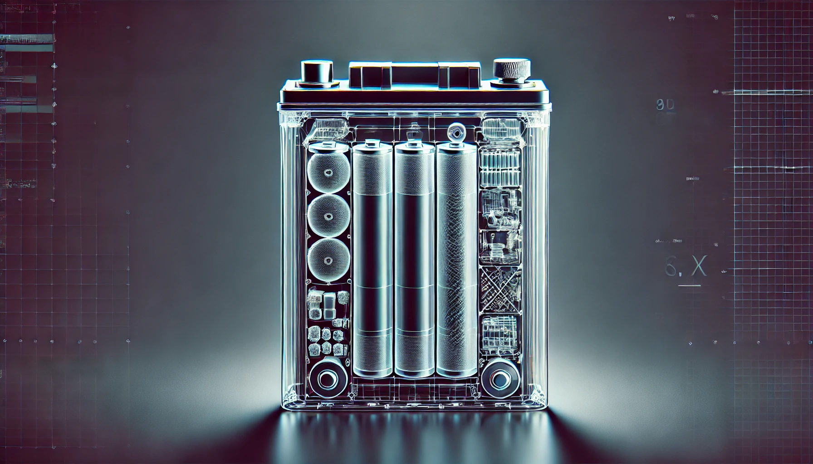
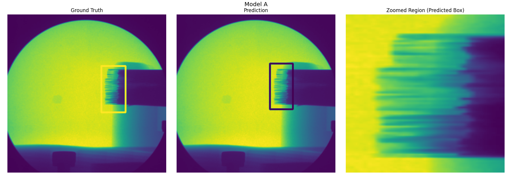
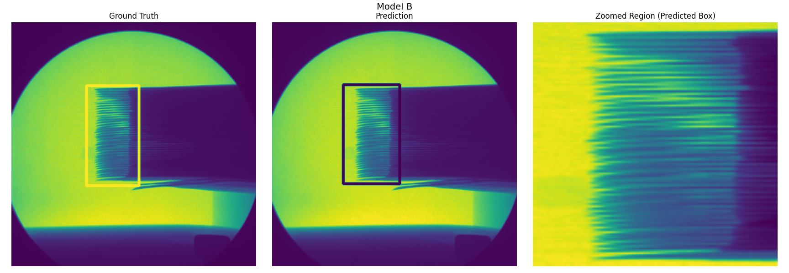
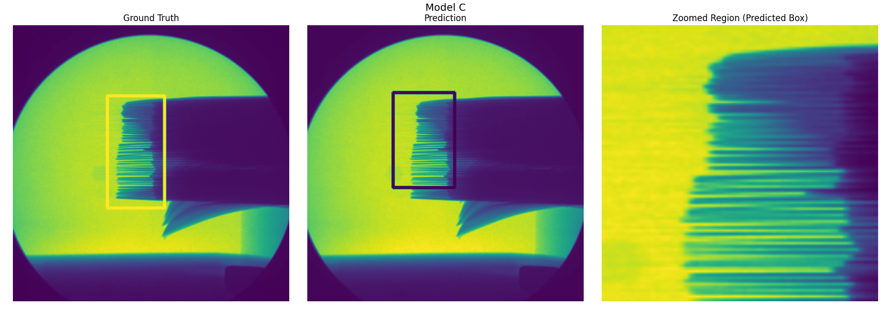

<div align="center">
   
# CT4Batt: A pipeline for Analyzing X-ray Chromatography Battery Images
   


</div>

This project explores a two-step machine learning approach for analyzing X-ray images of electrode stacks, using publicly available data from the X-ray-PBD dataset. The overarching goal is to identify and zoom in on the electrode tab region, and then isolate each individual electrode tab through segmentation.

In the first step, we focus on automatically locating a bounding box around the electrode tabs. We introduce a specialized convolutional neural network (CNN) equipped with attention mechanisms. This network employs coordinate attention, sliding window attention, and residual feature extractors to refine its understanding of the complex electrode structure. By predicting bounding boxes directly from the image, the network ensures that the downstream segmentation process can focus on a well-defined region of interest, thereby simplifying subsequent steps.

After obtaining a well-defined bounding region, the second part of the pipeline performs a segmentation task to isolate individual electrode tabs. We convert the zoomed-in, masked region into a series of probability maps, each intended to represent a distinct electrode tab. Using a dynamic approach, the model can handle images with variable sizes and different numbers of tabs. Each output channel of the segmentation model corresponds to a single tab, allowing us to extract a 3D array (Num_Tabs × Height × Width) of binary masks, where each mask highlights one tab at a time.

By carefully crafting each stage—first bounding box prediction, then targeted segmentation—we achieve a flexible and robust solution. The result is a system that can handle highly variable imagery: from the subtle differences in electrode tab shapes and arrangements to the diverse image resolutions and scales encountered in X-ray data. Our approach enables straightforward post-processing, visualization, and quantitative analysis of each tab in the electrode stack.

Looking ahead, this framework can be further extended and refined. While the current pipeline focuses on bounding box regression and binary segmentation, future iterations could incorporate more advanced instance segmentation techniques, improved attention modules, or additional shape priors. For now, this two-part solution provides a strong starting point for automated electrode tab detection and segmentation in complex X-ray imagery.

---

## 🚀 Overview
CT4Batt is designed to streamline the analysis of complex X-ray imagery with a focus on electrode tab detection and segmentation. The pipeline operates in two distinct stages:

1. **Bounding Box Prediction**: 
   - Employs a specialized CNN with advanced attention mechanisms.
   - Uses coordinate attention, sliding window attention, and residual feature extractors.
   - Outputs bounding boxes for regions of interest.

2. **Segmentation**: 
   - Converts the zoomed-in bounding region into a series of probability maps for individual tabs.
   - Handles images of varying sizes and tab counts dynamically.
   - Produces binary masks for each tab, facilitating downstream analysis.

---

## 📊 Results

For the zoom-in Contextual CNN models: 
<table>
  <tr>
    <th>Model</th>
    <th>Model A</th>
    <th>Model B</th>
    <th>Model C</th>
  </tr>
  <tr>
    <td>Approach</td>
    <td>CNN with KAN</td>
    <td>CNN with MLP</td>
    <td>Reduced CNN with KAN</td>
  </tr>
  <tr>
    <td>Number of Parameters</td>
    <td>23326976</td>
    <td>4442884</td>
    <td>3646976</td>
  </tr>
  <tr>
    <td>Loss (%) at 200 Epoch</td>
    <td>1.84%</td>
    <td>1.33%</td>
    <td>8.25%</td>
  </tr>
  <tr>
    <td>Average time/epoch (sec)</td>
    <td>0.42</td>
    <td>0.4</td>
    <td>0.4</td>
  </tr>
</table>

Obtained Predictions from Test Dataset: 
 
 
 

---

## 📂 Dataset
We utilized the **X-ray-PBD dataset**, which includes a variety of X-ray images of electrode stacks. The dataset features:
- High variability in tab shapes, arrangements, and resolutions.
- Images from different scales and equipment settings.
---

## ⚙️ How to Use
Follow these steps to get started:

1. **Clone the Repository**
   ```bash
   git clone https://github.com/your_username/CT4Batt.git
   cd CT4Batt
   ```

2. **Prepare the Dataset**
   - Download the X-ray-PBD dataset

3. **Train the Model * Predict**
   - Place the path to the dataset in evaluation/base.py file
   - For training and prediction:
   ```bash
   python base.py
   ```
---

## 📚 References
1. **X-ray-PBD Dataset**: [Dataset link](https://github.com/Xiaoqi-Zhao-DLUT/X-ray-PBD?tab=readme-ov-file)
2. **Source for KAN layer code**: [KAN](https://github.com/jakariaemon/CNN-KAN/blob/main/cnn_KAN.py)

---

## 📷 Visualizations
Below are some examples of bounding box prediction and segmentation results:

### Bounding Box Prediction


---

## 🌟 Future Work
This framework can be extended to:
- Incorporate advanced instance segmentation techniques.
- Enhance attention modules for improved feature extraction.
- Add shape priors for better performance on complex geometries.

---

## 🤝 Contributing
We welcome contributions! Please feel free to submit issues or pull requests to improve the project.

---

## 📝 License
This project is licensed under the [MIT License](LICENSE).

---

## 👩‍💻 Authors
**Amir Taqieddin** and **Forrest Laskowski**

**Affilation**: Solid Power Operating Inc., Louisville, CO 80027
